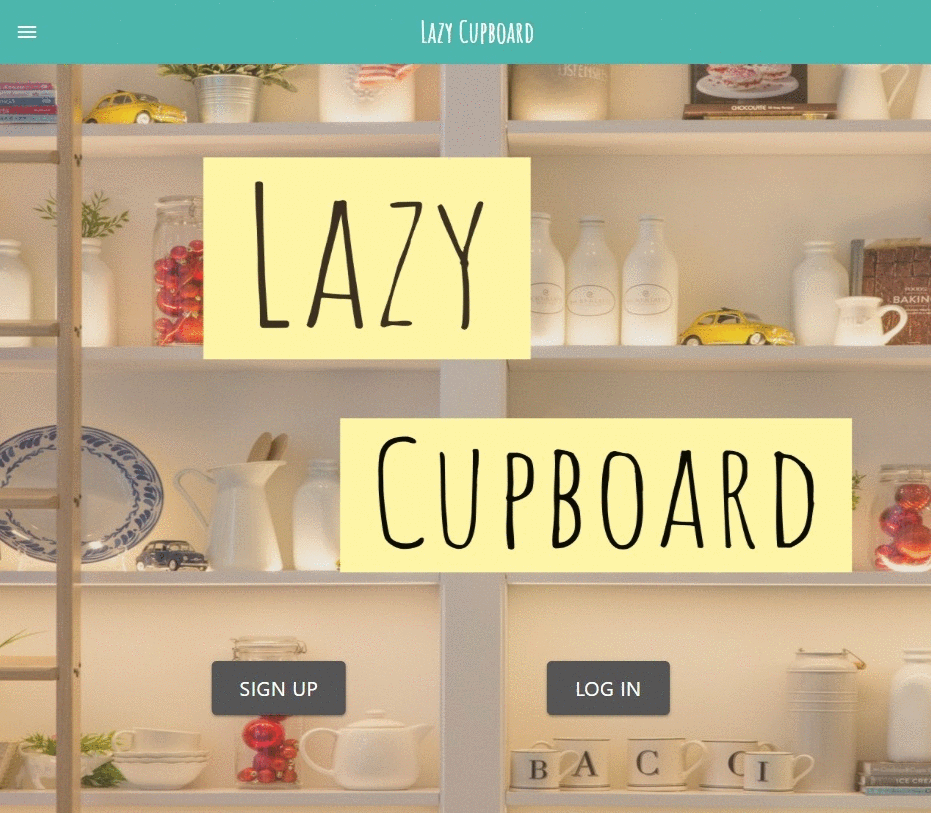
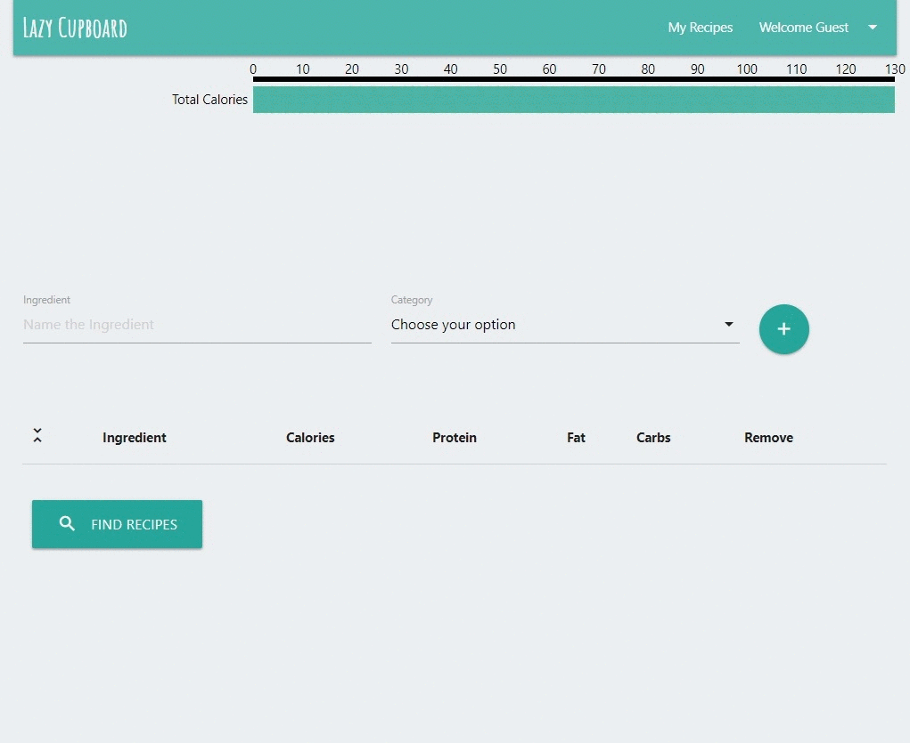
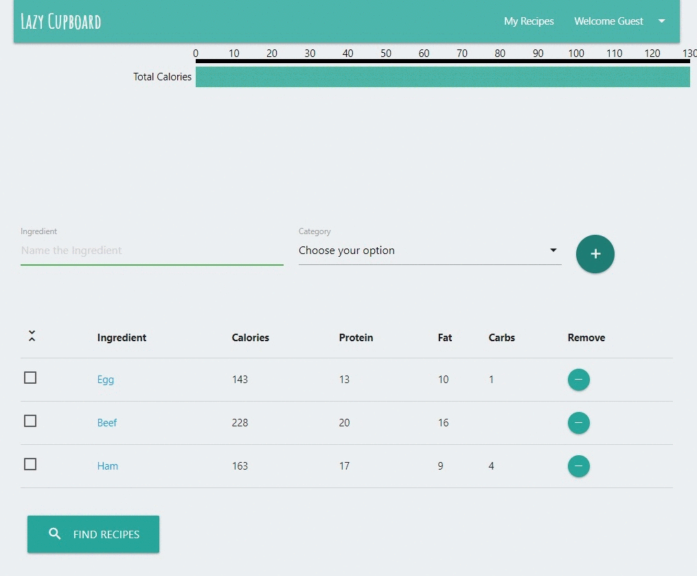
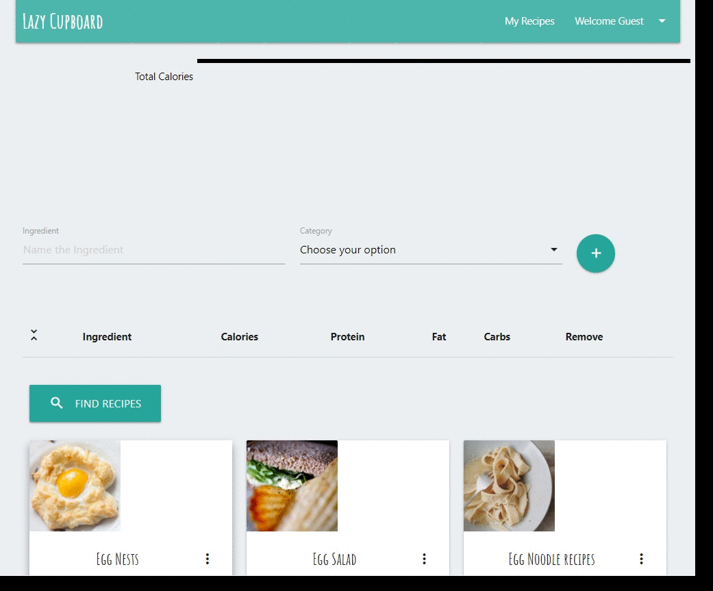
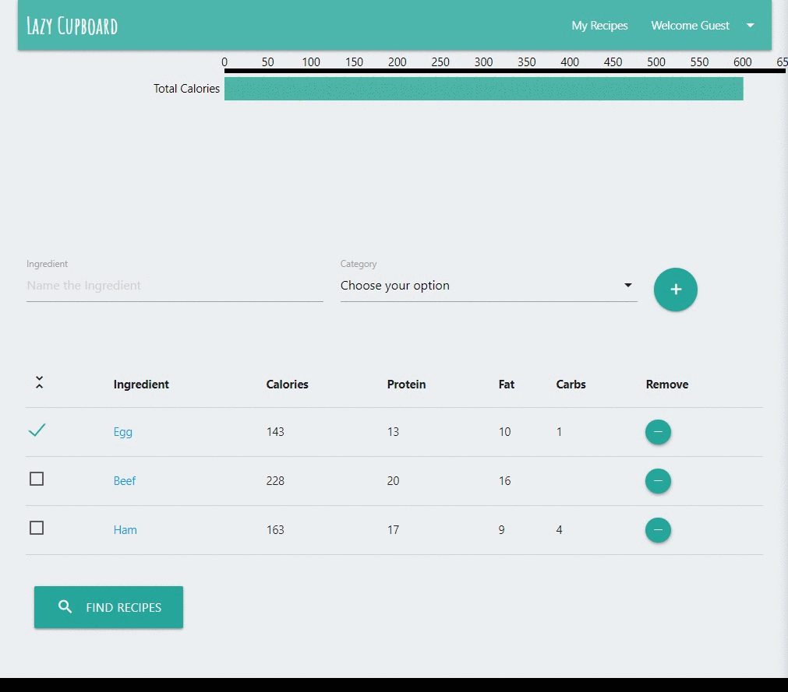

# Lazy Cupboard

## Welcome to LazyCupboard

Lazy cupboard is a fresh, new way to organize your recipes and manage your meals in a health-consious and budget friendly-way. 

This project gives structure to the user's eating habbits, while keeping variety and flexibility in mind by providing recipes that work for ingredients that they already have in their kitchen.

Lazy cupboard helps people save money and live more healthy lives by eating out less.
  

### How it Works

Lazy Cupboard takes care of the greuling process of making recipes and gives time back to the user.

First we authenticate our users using Passport.js. which then allows a viewer to view the home page.

Then we take the user input and save it in a query that looks through the Edamam API.
Once a user has clicked the ingredients they want to use(based on what they have gotten from the search) the app will query a search through edamaom to find recipes containing those ingredients. The search will then return the recipe options to the user. The user can then choose from the recipe list what they would like to make today.

Deployed site:[https://lazycupboard.herokuapp.com/](https://lazycupboard.herokuapp.com/)
  

### Technologies used
* JavaScript
* NodeJS
* Express
* Materialize CSS
* Passport
* Handlebars
* JQuery
* MySQL
* Sequelize ORM
* Axios
* Mocha, Chai, Travis
  

### New User Guide

#### Getting Started
 
1. On the landing page, you must either register for an account or login to get started. If you already have an account, click the 'Login' button. If you do not have an account, register by clicking on the 'Sign Up' button.
 
2. Fill out the registration form. Once you have registered, you will be redirected to the login page.
 

  

#### Add Ingredients To View Nutritional Facts
 
1. Click on the 'Ingredient' text box, type in an ingredient you have in your kitchen, then click the '+' button.
  
2. Repeat this step to add more ingredients on this page.
  

  
3. Review the nutritional facts of the ingredients you have entered, then use the check boxes to the left of the list to select the ingredients you would like find recipes for.
  
4. Click on the 'Find Recipes' to view available recipes.
  

  

#### Add Recipes To Your List of Recipes
 
1. After reviewing the recipes provided, save the recipes you like by clicking the 'Prepare' button for each recipe.
  
2. Once you have saved a few recipes, click on the 'My Recipes' button on the upper right of the page to view all saved recipes.
  

  

#### Navigate Back To The Add Ingredients Page
 
1. Navigate back to the initial page, where you can either:
  
-Add additional ingredients to view the available nutritional facts.
  
-Check the check box for any previously unchecked ingredients, then proceed to finding and saving more recipes.
  
-View details of recipes you have already saved.
  
2. Click on the 'Total Calories' bar on the top of the page to see the calorie count for a single serving of each recipe that was saved previously.
  
3. Click on 'My Recipes' to view available details for each recipe that was previously saved.
  

